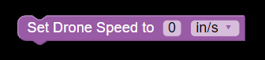
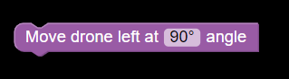
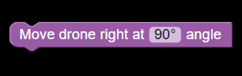
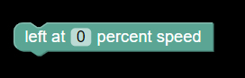
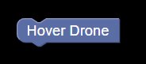

# [BASIC DRONE BLOCKS]()

1. [Drone speed](#drone_speed)

    
    <h4>Set speed of the drone accordingly in inch/sec or cm/sec.</h4>

2. [Take Off](#take_off)

    
    <h4 >Take off immediately.</h4>

3. [Take Off After](#takeoff_after)

    
    <h4>Take off after a certain specified time (in seconds).</h4>

4. [Hover Drone For Specified Time](#Hover_drone_time)

    
    <h4>Hover Drone for certain specified time (in seconds).</h4>

5. [Move Left clockwise](#move_left_clockwise)

    
    <h4>Move Drone clockwise at a certain angle (as specified).</h4>

6. [Move right anti-clockwise](#move_right_anticlockwise)

    
    <h4>Move Drone anti-clockwise at a certain angle (as specified).</h4>

7. [Move left at specified speed](#move_left_speed)

    
    <h4>Fly Drone left at a certain speed (as specified).</h4>

8. [Hover Drone](#Hover_drone)

    
    <h4>Hover Drone for unspecified time and speed.</h4>

9. [Fly Up](#fly_up)

    
    <h4>Fly Drone up.</h4>

