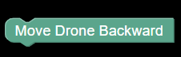

# [DRONE DIRECTION BLOCKS]()

1. [Move Drone Backward](#move_drone_backward)

    
    <h4>Move drone backward at unspecified speed and distance.</h4>

2. [Move Drone Forward](#move_drone_forward)

    
    <h4>Move drone forward at unspecified speed and distance.</h4>

3. [Move Drone Left](#move_drone_left)

    
    <h4>Move drone left at unspecified speed and distance.</h4>

4. [Move Drone Right](#move_drone_right)

    
    <h4>Move drone right at unspecified speed and distance.</h4>

5. [Fly Drone Backward](#fly_backward_distance)

    
    <h4>Fly drone backward to a certain distance specified in inch/sec or cm/s.</h4>

6. [Fly Drone Forward](#fly_forward_distance)

    
    <h4>Fly drone forward to a certain distance specified in inch/sec or cm/s.</h4>

7. [Fly Left To A Certain Distance](#fly_left_distance)

    
    <h4>Fly drone left to a certain distance specified in inch/sec or cm/s.</h4>

8. [Fly Right To A Certain Distance](#fly_right_distance)

    
    <h4>Fly drone right to a certain distance specified in inch/sec or cm/s.</h4>

9. [Fly Up To A Certain Distance](#fly_up_distance)

    
    <h4>Fly drone left to a certain distance specified in inch/sec or cm/s.</h4>

10. [Fly Down To A Certain Distance](#fly_down_distance)

    
    <h4>Fly drone down to a certain distance specified in inch/sec or cm/s.</h4>

