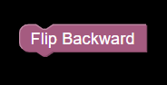

# [FLIP BLOCKS]()

1. [Flip Forward](#Flip_forward)

    
    <h4>Flip drone forward.</h4>

2. [Flip Backward](#Flip_backward)

    
    <h4>Flip drone backward.</h4>

3. [Flip Left](#Flip_left)

    
    <h4>Flip drone left.</h4>

4. [Flip Right](#Flip_right)

    
    <h4>Flip drone right.</h4>

