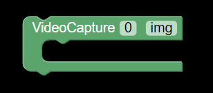
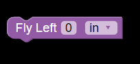
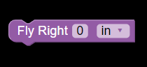

# [OPEN CV BLOCKS]()

1. [Import OpenCv](#opencv_import)

    
    <h4>Imports the opencv library required to perform computer vision operations.</h4>

2. [Import Numpy](#numpy_import)

    
    <h4>imports the numpy library. Numpy is used for working with arrays. It also has functions for working in domain of linear algebra, fourier transform, and matrices.</h4>

3. [Open Streamon](#open_streamon)

    
    <h4>Opens functionality for video streaming using drone.</h4>

4. [Insert Frame Read](#frame_read)

    
    <h4>Calls the frame read function required to read each frame of the video.</h4>

5. [Image Write](#image_write)

    
    <h4>Writes a image derived from the frame.</h4>

6. [Video Capture](#videocapture_cv)

    
    <h4>Video Capture.</h4>

<!-- 

7. [Fly Left To A Certain Distance](#fly_left_distance)

    
    <h4>Fly drone left to a certain distance specified in inch/sec or cm/s.</h4>

8. [Fly Right To A Certain Distance](#fly_right_distance)

    
    <h4>Fly drone right to a certain distance specified in inch/sec or cm/s.</h4>

9. [Fly Up To A Certain Distance](#fly_up_distance)

    
    <h4>Fly drone left to a certain distance specified in inch/sec or cm/s.</h4>

10. [Fly Down To A Certain Distance](#fly_down_distance)

    
    <h4>Fly drone down to a certain distance specified in inch/sec or cm/s.</h4>

 -->
