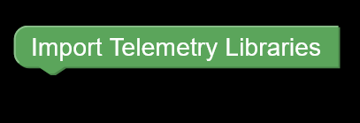
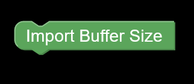
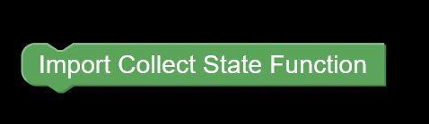

# [TELEMETRY BLOCKS]()

1. [Import Telemetry Libraries](#telemetry_libraries)

    
    <h4>Imports all the required libraries needed to execute the code.</h4>

2. [Buffer Size](#buffer_size)

    
    <h4>Imports the buffer size automatically.</h4>

3. [Import State](#State)

    
    <h4>Imports the drone state.</h4>

4. [Import Collect State](#collect_state)

    
    <h4>Imports the collect state functions.</h4>

5. [Import Main Function](#telemetry_main_function)

    
    <h4>Imports the telemetry main functions.</h4>

